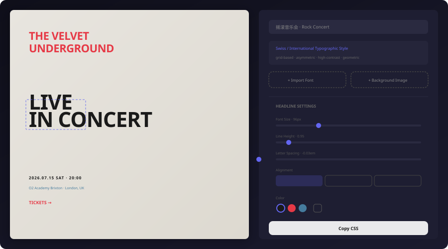

<p align="center">
  
</p>

<h1 align="center">Typography Lab</h1>

<p align="center">
  <strong>Typography for everything</strong><br/>
  14 content types · 8 typographic traditions · drag & drop · import fonts · edit images · export CSS
</p>

<p align="center">
  <a href="https://lov-alt.github.io/typography-lab/"></a>
  <a href="https://github.com/lov-alt/typography-lab/stargazers"></a>
  <a href="LICENSE"></a>
</p>

<p align="center">
  
</p>

---

## How it works

1. **Pick a content type** — concert poster, magazine cover, book page, business card...
2. **Get a professional layout** — each type maps to a real typographic tradition with curated fonts, sizes, spacing, and hierarchy
3. **Drag to customize** — every text block is draggable; click to edit font size, line height, letter spacing, alignment, color
4. **Import your assets** — drop `.ttf` / `.otf` / `.woff2` font files and images directly onto the canvas
5. **Edit images** — position, scale, brightness, contrast, saturation, blur, grayscale, opacity, 16 blend modes
6. **Export** — copy CSS for any selected element

## Content Types

| | | |
|---|---|---|
| **Posters** | Rock Concert · Classical Concert · Sports Event · Art Exhibition · Product Launch · Film Festival · Wedding | Swiss / Didone / New Wave / Minimalism / Constructivism |
| **Editorial** | Magazine Cover · Magazine Spread · Newspaper Front Page · Book Page | Editorial / News Design / Humanist |
| **Print** | Tri-Fold Brochure · Business Card · Certificate · Restaurant Menu | Corporate Swiss / Minimalism / Copperplate |

All layouts support both portrait (800×1100) and landscape (1100×780) orientations.

## Traditions

Each layout is rooted in a real typographic movement:

- **Swiss / International** (Müller-Brockmann, 1950s) — grid, asymmetric, sans-serif
- **Didone / Modern** (Bodoni, Didot) — extreme thick/thin contrast, elegant
- **New Wave / Postmodern** (Weingart, Greiman) — dynamic, angled, energetic
- **Old Style / Humanist** (Garamond, Jenson) — warm, readable, scholarly
- **Constructivism** (Rodchenko, Lissitzky) — geometric, bold, revolutionary
- **Minimalism** (Rams, Japanese ma) — whitespace, precision, calm
- **Editorial / News Design** — multi-column, hierarchical, rhythmic
- **Corporate Design** (Vignelli) — clean, structured, systematic

## Features

| | |
|---|---|
| **14 content types** | Posters, magazines, books, menus, business cards, certificates, brochures, newspapers... |
| **8 typographic traditions** | Swiss, Didone, New Wave, Humanist, Constructivism, Minimalism, Editorial, Corporate |
| **Drag & drop canvas** | Every text block and image is draggable — reposition freely |
| **Live text editing** | Click any block → adjust font size, line height, letter spacing, alignment, color |
| **Local font import** | Drop `.ttf` / `.otf` / `.woff2` files → auto `@font-face` injection |
| **Image editing** | Position, scale, brightness, contrast, saturation, blur, grayscale, opacity, 16 blend modes |
| **Landscape + portrait** | Magazine spreads, brochures, certificates use landscape; posters and books use portrait |
| **CSS export** | Copy production-ready CSS for any selected element |
| **Dark mode** | Follows system preference + manual toggle |
| **Zero dependencies** | No UI library, no backend — pure React + Tailwind |

## Project Structure

```text
src/
├── data/typography-rules.ts   # 14 layouts × 8 traditions — the knowledge base
├── pages/
│   ├── Home.tsx                # Content type gallery
│   └── Editor.tsx              # Interactive canvas + controls
├── components/
│   └── FontImporter.tsx        # Local font file loader
├── i18n/                       # zh / en / ja
├── App.tsx                     # Shell + dark mode + locale
└── main.tsx                    # Router entry
```

## Quick Start

```bash
git clone https://github.com/lov-alt/typography-lab.git
cd typography-lab
npm install
npm run dev
```

## Tech Stack

React 19 · TypeScript · Vite · Tailwind CSS v4 · React Router

## License

[MIT](./LICENSE) © 2026 lov-alt — Use freely, modify freely, distribute freely. Software provided "as is", without warranty of any kind.
